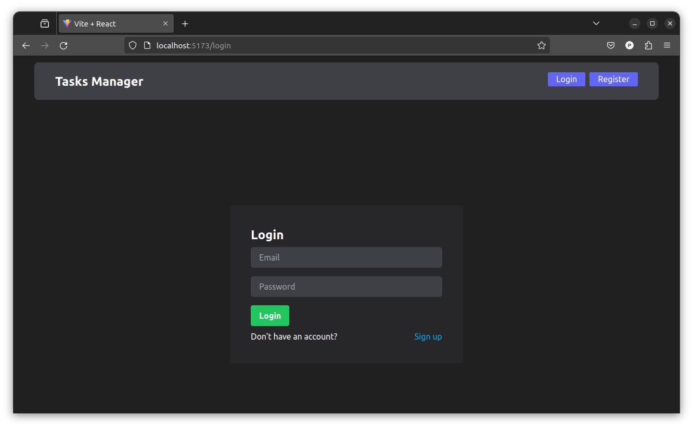
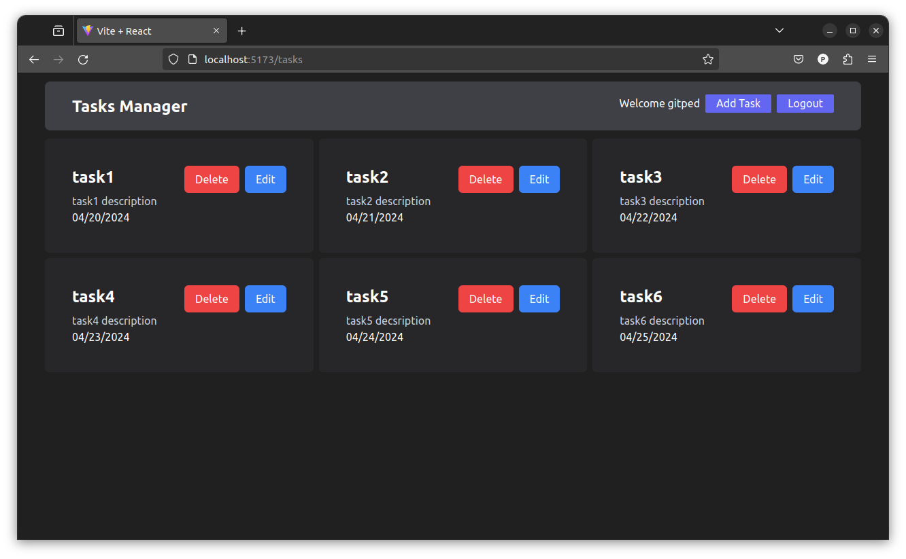

# Fullstack CRUD Task Manager
This project is a fullstack CRUD *(Create, Read, Update, Delete)* application developed using the MERN stack *(MongoDB, Express, React, and Node.js)*. It serves as a task manager that allows users to manage their tasks effectively.




## Notable Implementations
- **User Authentication**: The application features a user authentication system that allows users to register for accounts and securely log in to access their personalized task managers.

- **CRUD Functionality**: Users can perform CRUD operations on their tasks, including creating new tasks, viewing existing tasks, updating task details, and deleting tasks.

- **React Frontend**: The frontend of the application is built using React, a popular JavaScript library for building user interfaces. This ensures a smooth and responsive user experience.

- **MongoDB Database**: Backend data is managed using MongoDB, a NoSQL database that provides flexibility and scalability. This allows for efficient storage and retrieval of task data.

## Setup Instructions
To run the server and client components of the application, use the following command on the `/client` and `/` base directories:

```
npm run dev
```

## Usage
1. **Register Users**: Users can create new accounts by registering with a username, email and password.

2. **Login**: Registered users can securely log in to access their personalized task managers.

3. **Manage Tasks**: Once logged in, users can perform CRUD operations on their tasks, including creating new tasks, updating existing tasks, and deleting tasks.

## Technologies Used
- **Backend**: Express.js, MongoDB, Mongoose, Bcrypt.js, JSON Web Tokens (JWT), Zod, Cors
- **Frontend**: React, React Router DOM, React Hook Form, Tailwind CSS
- **Other**: Nodemon, Morgan, Axios, Js-Cookie, Day.js